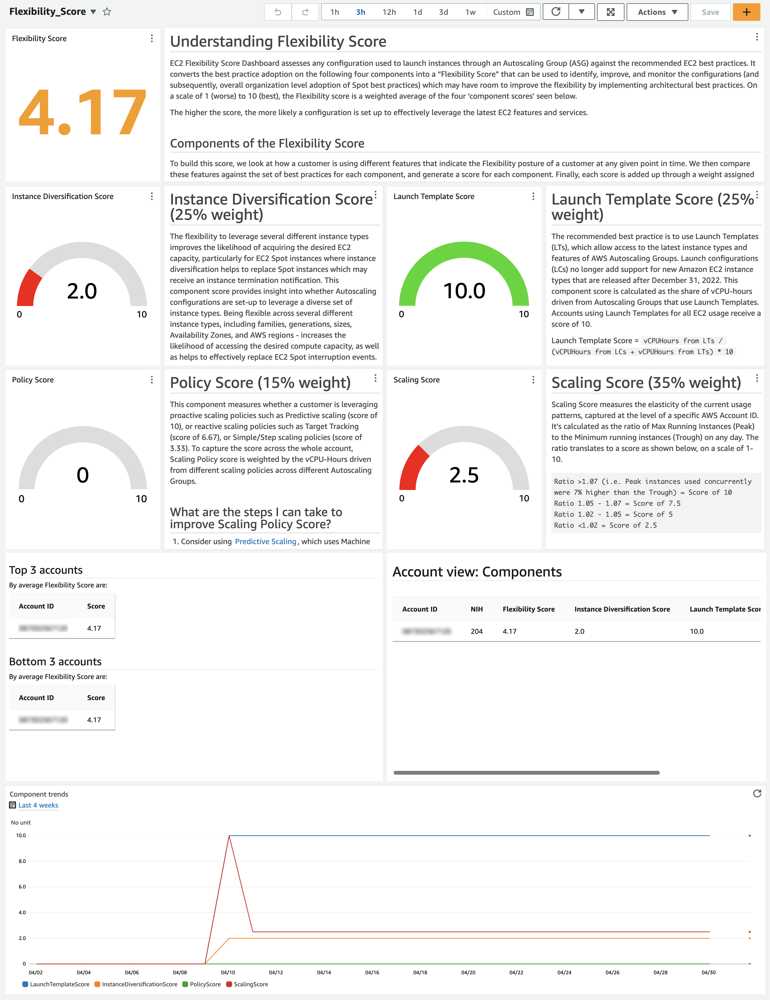
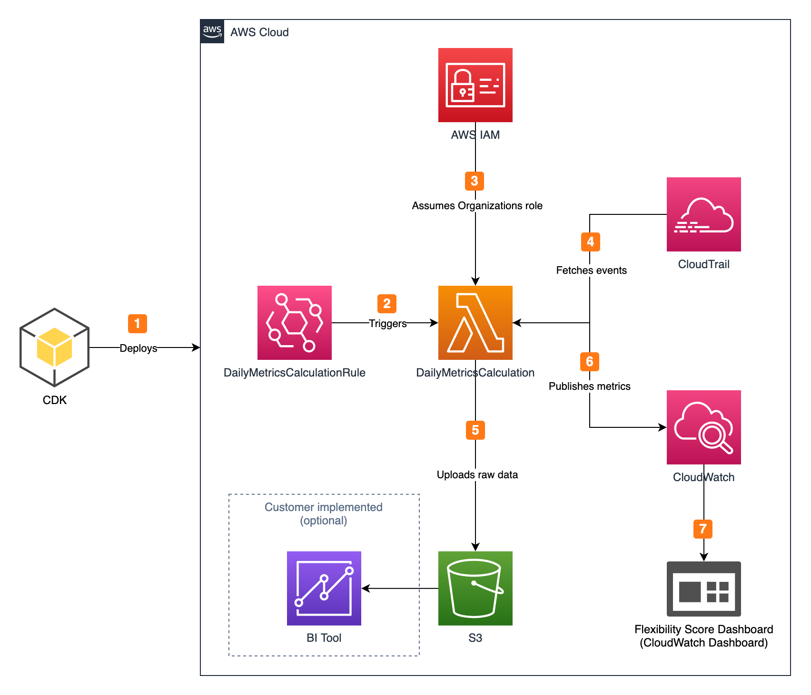

# EC2 Flexibility Score Dashboard

Authors: Borja Pérez Guasch <bpguasch@amazon.es>, Arpit Sapra <sapraa@amazon.ch>

## Introduction

EC2 Flexibility Score assesses any configuration used to launch instances through an Auto Scaling Group (ASG) against the recommended EC2
best practices. It converts the best practice adoption into a “flexibility score” that can be used to identify, improve,
and monitor the configurations (and subsequently, overall organization level adoption of Spot best practices)
which may have room to improve the flexibility by implementing architectural best practices.

The following illustration shows the EC2 Flexibility Score Dashboard:



## In this page

- [Understanding EC2 Flexibility Score](#understanding-ec2-flexibility-score)
- [Project architecture](#project-architecture)
- [Installation](#installation)
- [Updating](#updating)
- [Cleaning up](#cleaning-up)
- [Using the tool](#using-the-tool)
- [Security considerations](#security-considerations)

## Understanding EC2 Flexibility Score

On a scale of 1 (worse) to 10 (best), the EC2 Flexibility Score is a weighted average of the four component scores seen below. The higher the score, the more likely a configuration is set up to effectively leverage the latest EC2 features and services.

### Components of EC2 Flexibility Score

#### Instance Diversification score (25% weight)

The flexibility to leverage several different instance types improves the likelihood of acquiring the desired EC2 capacity,
particularly for EC2 Spot instances where instance diversification helps to replace Spot instances which may receive an
instance termination notification. This component score provides insight into whether Auto Scaling configurations are set up to
leverage a diverse set of instance types. Being flexible across several different instance types, including families, generations, sizes,
Availability Zones, and AWS regions, increases the likelihood of accessing the desired compute capacity,
as well as helps to effectively replace EC2 Spot interruption events.

Note: Launch configuration based ASGs receive a default score of 2. For Launch Templates, the score is calculated as below:

Amount of configured instance types | Score
----|-----
More than 15 or [Attribute-based Instance type selection](https://docs.aws.amazon.com/autoscaling/ec2/userguide/create-asg-instance-type-requirements.html) | 10
11-15 | 8
6-10 | 6
2-5 | 4
1 | 2

> What are the steps I can take to improve Instance Diversification Score?

1. Use Attribute Based Instance Selection (ABIS) to automate qualification and use of all possible instance types your workload can use. ABS can only be used with Launch Templates (see Launch Template Score section)
2. Use [EC2 Instance Selector](https://ec2spotworkshops.com/using_ec2_spot_instances_with_eks/040_eksmanagednodegroupswithspot/selecting_instance_types.html) to understand the various instance type options that can work for your requirements.
3. Check [EC2 Spot Best Practices](https://docs.aws.amazon.com/AWSEC2/latest/UserGuide/spot-best-practices.html#be-instance-type-flexible): ensure that all Availability Zones are configured for use in your VPC and selected for your workload.
4. Use Karpenter to provision and scale capacity. If you are using node groups and cluster autoscaler with EKS, Karpenter can help improve instance diversification by launching right-sized compute resources in response to changing application load, thereby reducing waste as well as ensuring access to capacity across all eligible instance types. It is an open-source, highly performant cluster autoscaler for Kubernetes.
5. Use [Spot Placement Score](https://docs.aws.amazon.com/AWSEC2/latest/UserGuide/spot-placement-score.html) which indicates how it is that a Spot Request will succeed in an AWS region or an Availability Zone. The open source project [EC2 Spot Placement Score Tracker](https://github.com/aws-samples/ec2-spot-placement-score-tracker) offers the ability to track SPS over time for different configurations.

#### Launch Template score (25% weight)

The recommended best practice is to use Launch Templates (LTs), which allow access to the latest instance types and features of
AWS Auto Scaling groups. Launch configurations (LCs) no longer add support for new Amazon EC2 Instance types that are released after
December 31, 2022. This component score is calculated as the share of vCPU-hours driven from Auto Scaling groups that use Launch Templates.
Accounts using Launch Templates for all EC2 usage receive a score of 10.

Launch Template Score = `vCPU-hours from LTs / (vCPU-hours from LCs + vCPU-hours from LTs) * 10`

> What are the steps I can take to improve Launch Template Score?

1. Use [Launch Templates](https://docs.aws.amazon.com/autoscaling/ec2/userguide/launch-templates.html) to create any new Autoscaling Groups.
2. [Migrate your Launch Configurations to Launch Templates](https://docs.aws.amazon.com/autoscaling/ec2/userguide/migrate-to-launch-templates.html).
3. Follow [this workshop](https://ec2spotworkshops.com/ec2-auto-scaling-with-multiple-instance-types-and-purchase-options.html) to familiarise with general Auto Scaling best practices.

#### Policy score (15% weight)

This component measures whether you are leveraging proactive scaling policies such as Predictive scaling (score of 10),
or reactive scaling policies such as Target Tracking (score of 6.67), or Simple/Step scaling policies (score of 3.33).
To capture the score across the whole account, Scaling Policy score is weighted by the vCPU-Hours driven from different scaling
policies across different Auto Scaling groups.

> What are the steps I can take to improve Scaling Policy Score?

1. Consider using [Predictive Scaling](https://docs.aws.amazon.com/autoscaling/ec2/userguide/ec2-auto-scaling-predictive-scaling.html), which uses Machine Learning to predict capacity requirements based on historical usage from CloudWatch. Check out a [hands-on workshop](https://ec2spotworkshops.com/efficient-and-resilient-ec2-auto-scaling/lab1/10-predictive-scaling.html) to implement predictive scaling.
2. Evaluate if using [Target Tracking Policy](https://docs.aws.amazon.com/autoscaling/ec2/userguide/as-scaling-target-tracking.html) can better serve your scaling needs than Simple/Step Scaling Policies.

#### Scaling score (35% weight)

Scaling Score measures the elasticity of the current usage patterns.
It’s calculated as the ratio of Max Running instances (Peak) to the Minimum running instances (Trough) on any day.
The ratio translates to a score as shown below, on a scale of 1-10.

Ratio | Score
----|-----
Greater than 1.07 | 10
1.05 - 1.07 | 7.5
1.02 - 1.05 | 5
Lower than 1.02 | 2.5

> I have a low scaling score. What does it mean?

Low scaling score means that the usage in the specific account doesn't scale up or down too much over time, which could be an indicator of over-provisioning.
While this is workload dependent, as some workloads may need the ability to scale more than others, it is worth evaluating if there is room for efficiency by using a more dynamic scaling approach.
This could lead to greater cost savings and reducing waste of compute resources.

> What are the steps I can take to improve scaling score?

1. Understand the different [scaling options](https://docs.aws.amazon.com/autoscaling/ec2/userguide/scale-your-group.html) you can use with Autoscaling Groups.
2. Adopt [Karpenter](https://aws.amazon.com/blogs/aws/introducing-karpenter-an-open-source-high-performance-kubernetes-cluster-autoscaler/). If you are using Managed Node Groups with EKS, Karpenter can help you improve your application availability and cluster efficiency by rapidly launching right-sized compute resources in response to changing application load, thus reducing waste. It is an open-source, highly performant cluster autoscaler for Kubernetes.
3. Set up [AWS Compute Optimizer](https://aws.amazon.com/compute-optimizer/) (free to use), which can help you right-size over-provisioned / under-utilized instances.

## Project architecture



The open source project consists of a CDK IaC project designed to be deployed in the payer account (1)
(where you have AWS Organizations configured) for calculations to be performed in a centralised and aggregated manner.
If you don’t use AWS Organizations, you can still deploy the same CDK project in any of your accounts,
and the calculations will be performed only considering the resources deployed in that account.

The Lambda function `DailyMetricsCalculation` is executed every 3 hours by means of an Amazon EventBridge rule (2) to pull events
from CloudTrail and identify resources deployed in the account (4). It has been configured with a 3-hour rate so that the
produced CloudWatch metrics don't lose resolution. By using CloudTrail events, ASGs, Launch Templates, EC2 Instances
and other resources are detected even if those are deleted by the time the function is executed.

Once all relevant resources are identified, scores are calculated and published in CloudWatch as custom metrics (6).
Also, the same scores are uploaded to S3 (5) for you to be able to implement your own visual representations.

There is a CloudWatch dashboard that feeds from CloudWatch metrics to display weighted scores in a time range (7).

## Requirements

- Python >= 3.8
- [CDK](https://docs.aws.amazon.com/cdk/v2/guide/getting_started.html) >= 2.88.0
- [venv](https://docs.python.org/3/library/venv.html)
- [AWS Command Line Interface (CLI)](https://docs.aws.amazon.com/cli/latest/userguide/getting-started-prereqs.html)

Follow [these steps](https://docs.aws.amazon.com/cli/latest/userguide/cli-chap-configure.html) to configure the AWS CLI with your AWS account.

## Installation

### 1. Cloning the repository

After navigating to your path of choice, run this command to clone this repository:

```bash
git clone git@github.com:aws-samples/ec2-flexibility-score-dashboard.git
```

### 2. Creating a virtual environment and installing project dependencies

#### 2.1 Creating the virtual environment

```python
cd ec2-flexibility-score-dashboard
python3 -m venv .venv
```

#### 2.2 Installing project dependencies in the virtual environment

```python
source .venv/bin/activate
python -m pip install -r requirements.txt
```

### 3. Bootstrapping your AWS account

Deploying AWS CDK apps into an AWS environment may require that you provision resources the AWS CDK needs to perform the deployment.
These resources include an Amazon S3 bucket for storing files and **IAM roles that grant permissions needed to perform deployments**.
Execute the following command to bootstrap your environment:

```bash
cdk bootstrap
```

You can read more about this process [here](https://docs.aws.amazon.com/cdk/v2/guide/bootstrapping.html).

### 4. Deploying using CDK

An important part of the project is the name of the IAM role that the `DailyMetricsCalculation` function assumes to retrieve
CloudTrail logs from all the accounts in your organisation. The name of this IAM role is obtained from a stack parameter named `ParamOrgRoleName`,
which has a default value of `OrganizationAccountAccessRole`. This is the name of the IAM role that AWS Organisations creates when you
create an account in your organisation (view the [Considerations section](#considerations) for more details).

To deploy the stack without overwriting the value of the `ParamOrgRoleName` parameter, run the following command:

```bash
cdk deploy
```

If you want to use a custom IAM role, you can specify its name when deploying the stack as shown below:

```bash
cdk deploy --parameters ParamOrgRoleName=<role_name>
```

The deployment process will take roughly **3 minutes** to complete. In the meantime, you can visit [using the tool](#using-the-tool).

## Updating

To update the project, navigate to the directory where you initially cloned the project and execute the following command:

```bash
git pull
cdk deploy
```

## Cleaning up

Option 1) deleting all the resources created by CDK using the AWS Console:

1. Navigate to the **CloudFormation** section in the AWS console.
2. Select the stack named **FlexibilityScore** and click on **Delete**.

Option 2) deleting all the resources created by CDK using the CLI:

Navigate to the directory where you initially cloned the project and execute the following command:

```bash
cdk destroy
```

## Using the tool

Once you have deployed the project:

1. In the AWS Console, navigate to the CloudWatch service page
2. On the left-side panel, click on **Dashboards**
3. Under **Custom Dashboards**, click on **Flexibility-Score-Dashboard**

The dashboard uses some Lambda-backed custom widgets to display information. The first time that you open the dashboard
you'll see a message asking you to allow the widgets to execute the Lambda functions. Click on **Allow always**.

The dashboard will show no data until the `DailyMetricsCalculation` function is executed for the first time.
**Allow for up to 5 minutes after deploying the project to see the widgets rendering the scores.**

The dashboard will show the component scores and the weighted Flexibility Score in the time range that you have selected. To update it,
use the controls at the top of the screen.

## Security considerations

In order for the `DailyMetricsCalculation` function to be able to retrieve CloudTrail logs from other accounts,
it needs to assume an IAM role that grants it permission to do so. By default, when an account is created in your organization,
AWS Organizations automatically creates an IAM role that is named `OrganizationAccountAccessRole` (you can read more about it [here](https://docs.aws.amazon.com/organizations/latest/userguide/orgs_manage_accounts_access.html)).
This role has administrator privileges.

If you want to use a custom IAM role, be aware that the role must exist in all the accounts in your organization for which
you want to calculate the Flexibility Score. Also, the following IAM statements must be included for the Lambda function
to execute successfully:

```
{
    "Action": [
        "cloudtrail:LookupEvents",
        "cloudwatch:PutMetricData",
        "ec2:DescribeRegions",
        "organizations:DescribeOrganization",
        "organizations:ListAccounts"
    ],
    "Resource": "*",
    "Effect": "Allow"
}
```